# Tugas 2 IF3110 Pengembangan Aplikasi Berbasis Web

## Deskripsi aplikasi web (Willy Wangky Factory)

Aplikasi Penjualan Coklat ini merupakan aplikasi berbasis web yang ditulis dalam rangka memenuhi pengerjaan 
tugas besar 1 Mata Kuliah IF3110 Pemgembangan Aplikasi Berbasis Web. Aplikasi ini merupakan sebuah platform 
untuk melakukan jual beli coklat, dan dibuat dengan menggunakan tools-tools sebagai berikut:

- HTML
- CSS
- Javascript
- PHP
- MySQL

Fitur-fitur dan halaman yang terdapat pada aplikasi ini adalah sebagai berikut:

### Login dan Registrasi Akun

Pengguna melakukan login dan/atau registrasi terlebih dahulu sebelum memasuki laman utama.
Pengguna biasa yang melakukan registrasi disebut sebagai user, dan admin (yang datanya dimasukkan
secara langsung pada database) disebut sebagai superuser.

### Dashboard Page

Halaman dashboard menampilkan gambar sepuluh coklat dengan penjualan paling tertinggi.
Selain itu, terdapat tampilan untuk menuju Transaction History Page (bagi user) dan Add New Chocolate Page (bagi superuser).

### Search

Fitur search memberikan layanan untuk melakukan pencarian, saat ini tingkat pencarian hanya sampai sejauh case-insensitive.

### Chocolate Detail Page

Menampilkan detail dari coklat yang dijual dengan rincian data-data berikut:

Nama coklat, harga, jumlah yang tersedia, jumlah yang terjual, deskripsi.

Selain itu, pada halaman ini superuser dapat menambah jumlah coklat, dan user dapat membeli coklat.


### Transaction History Page

Laman ini hanya tersedia untuk user (dilakukan validasi terlebih dahulu).
Pada laman ini terdapat tabel yang menampilkan daftar pembelian yang telah dilakukan oleh user tersebut, 
terurut dari yang paling recent.

### Add New Chocolate Page

Laman ini hanya tersedia untuk superuser (dilakukan validasi terlebih dahulu).
Pada laman ini terdapat menu untuk menambahkan coklat baru, dengan mengisi data-data coklat (nama, harga, gambar, dll.)

Sebagai tambahan, aplikasi ini juga mengimplementasikan token pada cookie yang bisa expired (waktunya terbatas).

### Deskripsi Basis Data dan Perubahan Pada Tugas Besar 2

Basis Data dari Willy Wangky Web adalah sebagai berikut:

| Nama Tabel  | Atribut |
| ------------- | ------------- |
| coklat  | (idcoklat, choco_name, price, imgpath, amount, amountsold, description)  |
| cookies  | (cookie_auth, username)  |
| transaksi  | (idtransaksi, choco_name, amount, totalprice, date, time, address, username)  |
| users  | (username, email, password, role)  |

Dengan tambahan sebuah tabel baru yaitu `pending_requests` untuk menyimpan daftar request penambahan stok coklat.

## Daftar requirement

- PHP 7.4
- Apache 2
- Javascript (Browser supporting JS ES6)
- HTML + CSS (Browser supporting HTML, CSS) 
- MySQL 8

Sebagai alternatif, PHP + Apache + MySQL bisa diperoleh secara langsung menggunakan XAMPP.

## Cara instalasi

### Windows

Untuk mempermudah instalasi, Anda bisa menggunakan XAMPP _stack_ yang bisa Anda unduh di [sini](https://www.apachefriends.org/download.html)

### Linux (Ubuntu)

#### Instalasi Apache

1. Pastikan Anda sudah melakukan update repo Anda.

```shell
$ sudo apt update
```

2. _Install_ Apache (jika belum).

```shell
$ sudo apt install apache2
```

3. Kemudian, pastikan Apache sudah ter-_install_ dengan baik dengan membuka [localhost](http://127.0.0.1).

#### Instalasi MySQL

1. Pastikan Anda sudah melakukan update repo Anda.

```shell
$ sudo apt update
```

2. _Install_ MySQL (jika belum).

```shell
$ sudo apt install mysql-server
```

3. Jalankan secure installation untuk menghilangkan pengaturan _security_ yang kurang tidak baik.

```shell
$ sudo mysql_secure_installation
```

4. Ikuti proses yang ada di layar terminal.

Namun, kita harus membuat _user_ baru dulu agar bisa mengakses _database_ kita melalui MySQL dengan menggunakan PHP. _User_ baru ini akan kita berikan semua _privilege_.

1. Masuk ke MySQL dengan root access.

```shell
$ sudo mysql -u root
```

2. Tambahkan _user_ baru. (Ganti YOUR*SYSTEM_USER dan PASSWORD dengan \_username* dan _password_ yang Anda inginkan).

```shell
mysql> USE mysql;
mysql> CREATE USER 'YOUR_SYSTEM_USER'@'localhost' IDENTIFIED BY 'PASSWORD';
mysql> GRANT ALL PRIVILEGES ON *.* TO 'YOUR_SYSTEM_USER'@'localhost';
mysql> exit;
```

3. Setelah itu, _restart_ MySQL Anda.

```shell
$ sudo service mysql restart
```

#### Instalasi PHP

1. Pastikan Anda sudah melakukan update repo Anda.

```shell
$ sudo apt update
```

2. _Install_ PHP (jika belum).

```shell
$ sudo apt install php libapache2-mod-php php-mysql
```

3. Pastikan PHP ter-_install_ dengan baik.

```shell
$ php -v
```

Terakhir, pastikan apache2 dan mysql sudah berjalan dengan menulis _command_

```shell
$ sudo service --status-all
```

dan pastikan Anda melihat

[+] apache2

[+] mysql

Jika ternyata salah satu tidak seperti itu, jalankan terlebih dahulu.

```shell
$ sudo service apache2 start
```

atau

```shell
$ sudo service mysql start
```

## Cara menjalankan Server

### Windows

1. Dengan menggunakan XAMPP, masukkan folder ini atau _clone_ repository ini ke dalam folder htdocs.

```
<path_to_xampp>/htdocs/
```

2. Nyalakan Apache dan MySQL melalui XAMPP Control Panel.
3. Tekan tombol `Admin` pada MySQL untuk membuka `phpmyadmin`.
4. Buat _database_ baru.
5. _Import_ SQL _script_ `./db/final_db.sql`.
6. Buat file baru di dalam folder `php` yang ada di folder ini dengan nama `configDB.php`.
7. _Copy paste_ isi `config.php.example` dan ubah sesuai dengan aturan Anda.
8. Anda bisa membuka localhost dan _append_ path dari htdocs ke folder ini di belakang localhost.

### Linux (Ubuntu)

1. Pastikan Apache dan MySQL telah menyala.
2. Masukkan folder ini ke `/var/www/html/`.

```shell
$ mv tugas-besar-1-2020 /var/www/html
```

3. Masuk ke MySQL dengan menggunakan _user_ yang telah dibuat sebelumnya

```shell
$ mysql -u 'YOUR_SYSTEM_USER' -p
```

4. Buat _database_ baru dan keluar dari MySQL.

```shell
mysql> CREATE DATABASE chocofactory;
mysql> exit;
```

5. Import _database_ dari `./db/final_db.sql`.

```shell
$ mysql -u 'YOUR_SYSTEM_USER' -p chocofactory < path_to_folder_ini/db/final_db.sql
```

6. Buat file baru di dalam folder `php` yang ada di folder ini dengan nama `configDB.php`.
7. _Copy paste_ isi `config.php.example` dan ubah sesuai dengan aturan Anda.
8. Anda bisa membuka localhost dan _append_ path dari /var/www/html/ ke folder ini di belakang localhost.
   Misalnya: `localhost/tubes-besar-1-2020/`

## Screenshot aplikasi

### Login Page

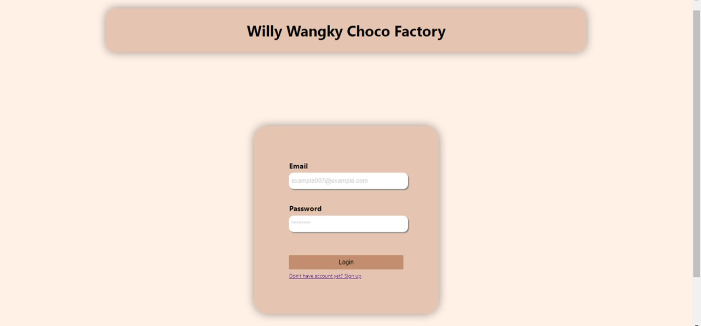

### Logout Page

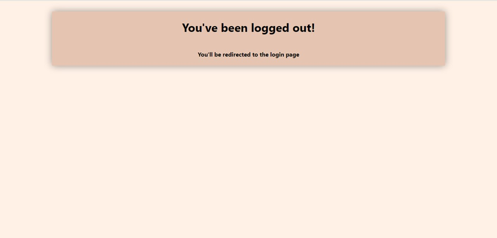

### Register Page

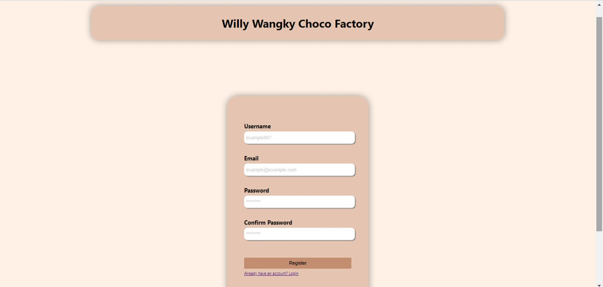

### Dashboard Page

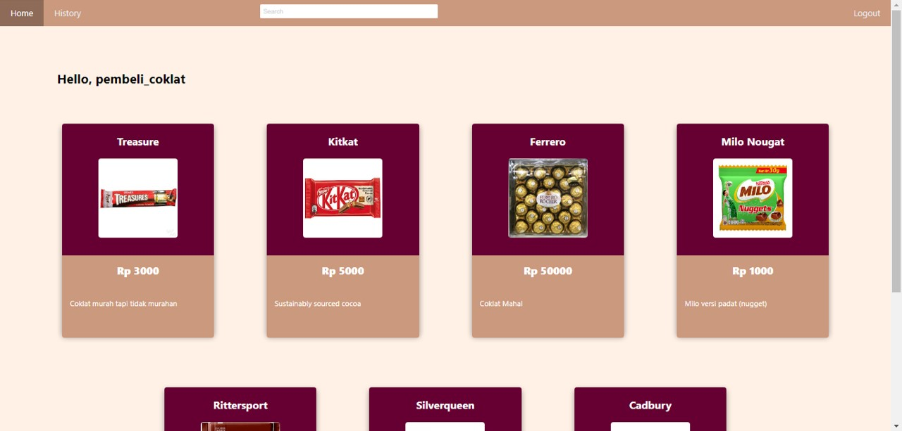

### Search Result Page

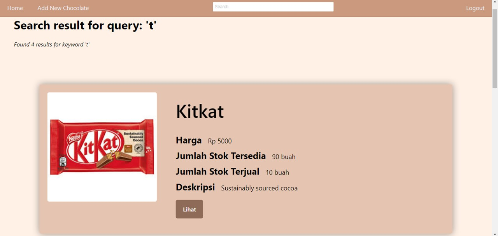

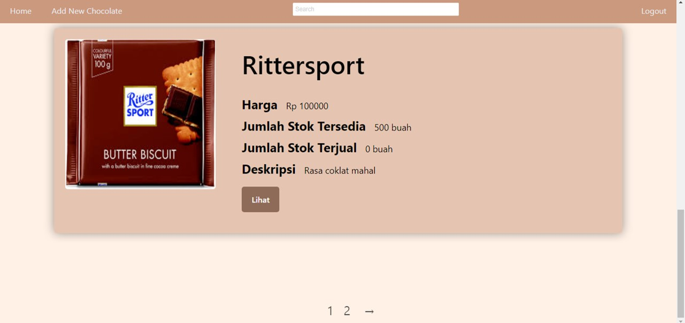

### Chocolate Detail Page

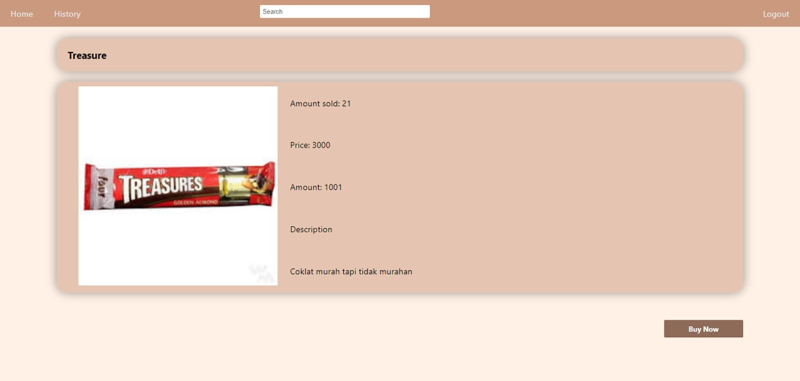

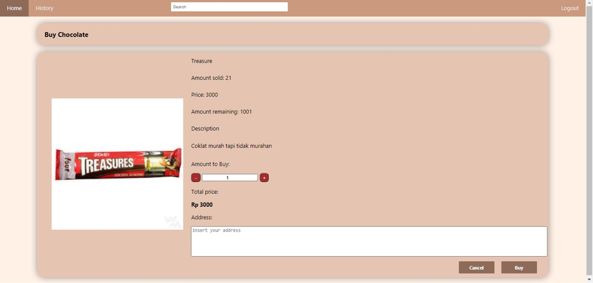

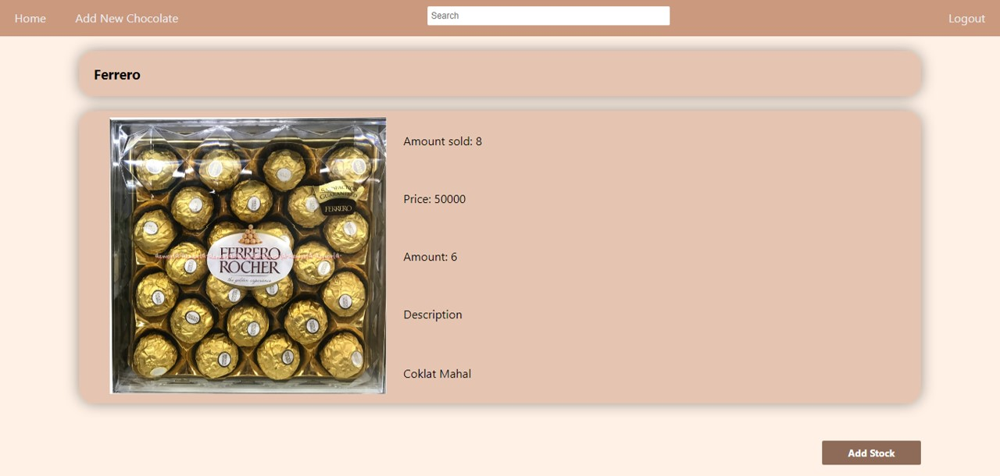

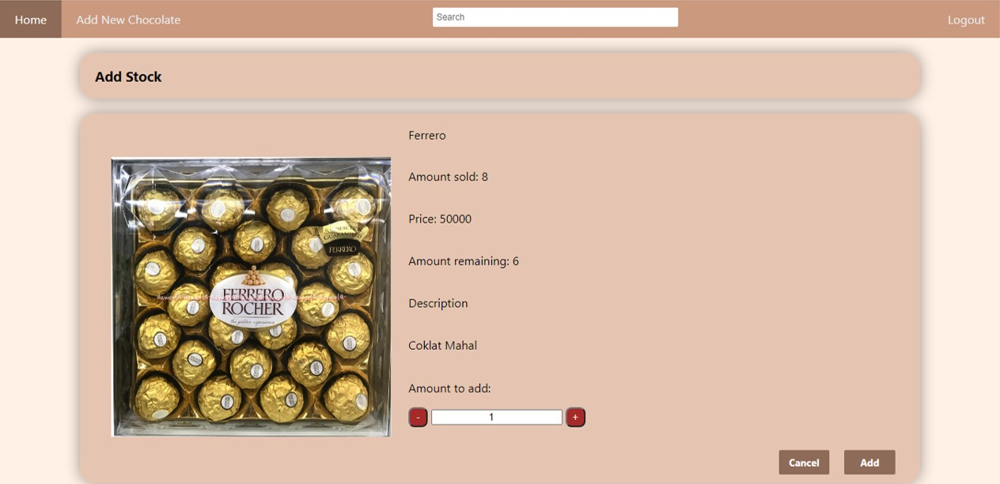

### Transaction History Page

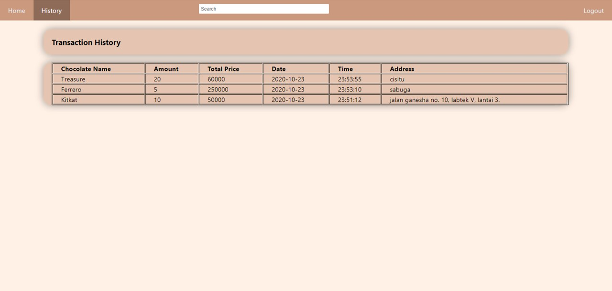

### Add New Chocolate Page

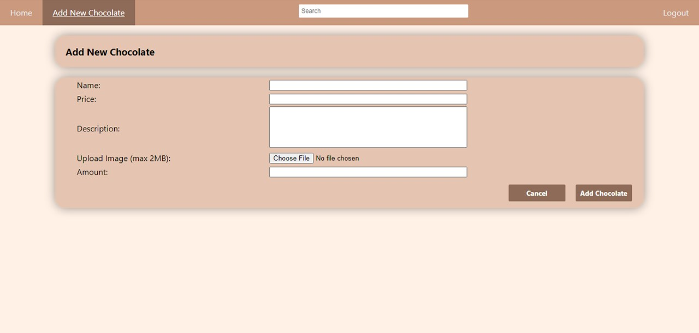

#### Perubahan Pada Tugas Besar 2


## Pembagian Tugas

Berikut pembagian tugas tiap anggota kelompok

### Frontend

1. Login : 13518041
2. Register : 13518041
3. Dashboard : 13518041
4. Search Result : 13518017
5. Choco Detail : 13518048
6. Transaction History : 13518048
7. Add New Chocolate : 13518048

### Backend

1. Login : 13518041
2. Register : 13518041
3. Dashboard : 13518041
4. Search Result : 13518017, 13518048 (Pagination)
5. Choco Detail : 13518048
6. Transaction History : 13518017
7. Add New Chocolate : 13518017

### Perubahan Willy Wangky's Web (Tugas Besar 2)

1. Pengiriman Request Saat Melakukan Add Stock Coklat (Add Stock) : 13518048
2. Pengecekan Status Request ke Web Service : 13518041
3. Pembuatan Coklat Baru (Penambahan Data Material Coklat berdasarkan Data dari Supplier, Menampilkan Harga Total Material) / Add New Chocolate : 13518017
4. Pengiriman Resep Coklat ke Web Service Factory (Add New Chocolate) : 13518017
5. Pemanggilan Request ke Web Service Factory untuk mengubah Saldo saat penjualan (Saldo) : 13518048

## About

Kelompok 4 Tugas Besar 2 IF3110 Pengembangan Aplikasi Berbasis Web

Farras | Samuel | Hengky
